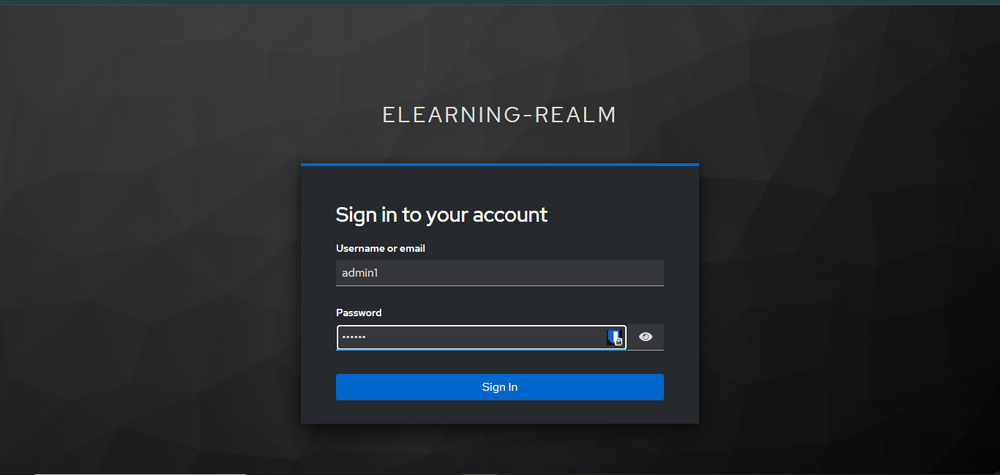
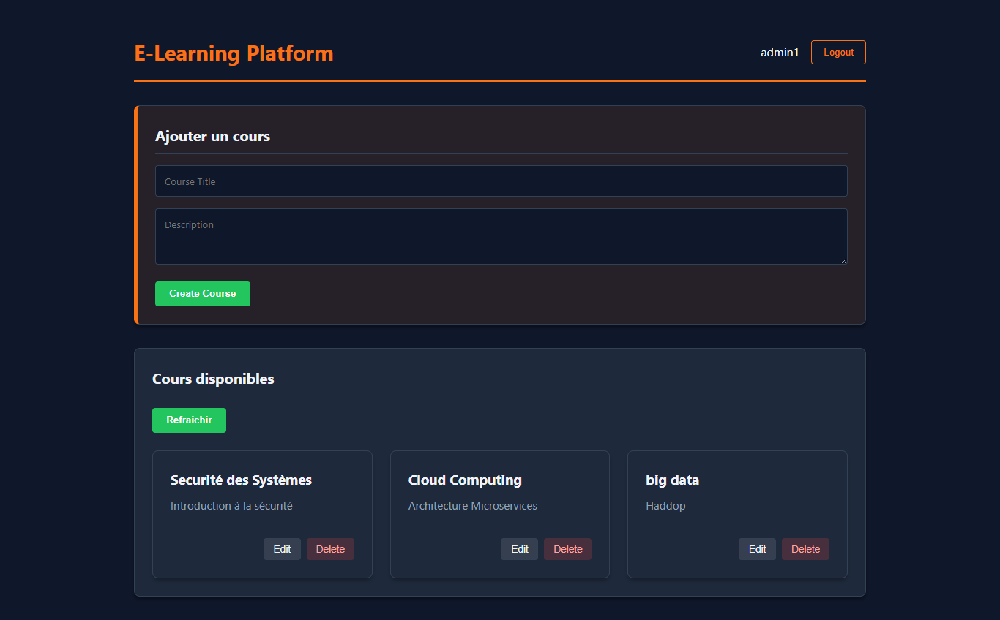
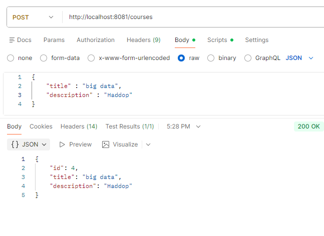
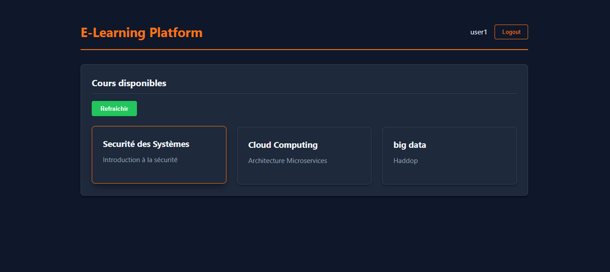
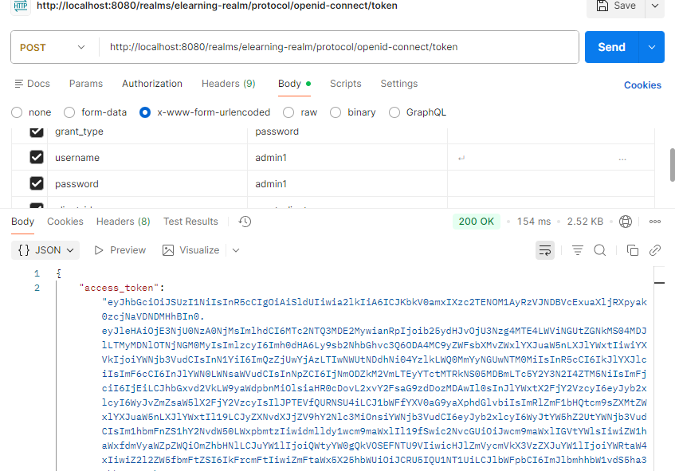
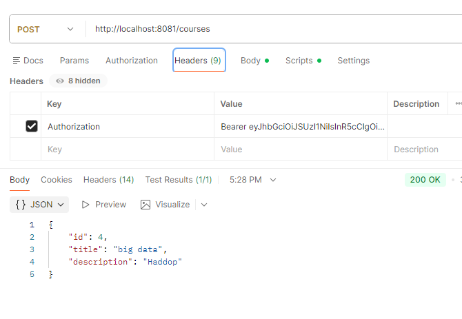
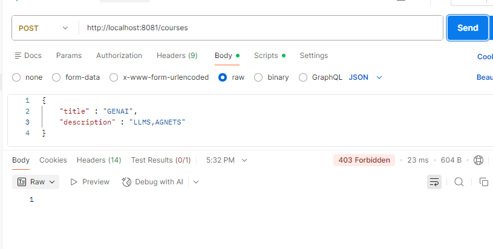

# Rapport TP3 : Sécurité des Applications Web - OAuth2 & OpenID Connect

Ce projet met en œuvre une architecture sécurisée de type **Microservices** utilisant le protocole **OAuth2 / OpenID Connect**. Il démontre comment déléguer l'authentification à un fournisseur d'identité (**Keycloak**) et sécuriser une application Frontend (**React**) ainsi qu'une API Backend (**Spring Boot**).

## 1. Architecture du Système

L'architecture repose sur la séparation des responsabilités :
- **Keycloak** : Agit comme l'Authorization Server (AS). Il gère les utilisateurs, les rôles et délivre les tokens JWT.
- **Frontend (React)** : Agit comme le Client (Public Client). Il redirige l'utilisateur vers Keycloak pour l'authentification et stocke le token d'accès.
- **Backend (Spring Boot)** : Agit comme le Resource Server. Il valide le token JWT reçu dans les en-têtes HTTP et protège les endpoints API.

## 2. Technologies Utilisées

- **Identité** : Keycloak (Docker/Local)
- **Backend** : Java 21, Spring Boot 3.2, Spring Security 6, H2 Database.
- **Frontend** : React (Vite), Axios, Keycloak-js.
- **Protocole** : OAuth 2.0, OpenID Connect (OIDC).

---

## 3. Fonctionnalités et Sécurité

### Authentification Centralisée
L'authentification n'est pas gérée par l'application elle-même mais déléguée à Keycloak. Cela permet le **SSO (Single Sign-On)** et une meilleure sécurité.

### Contrôle d'Accès Basé sur les Rôles (RBAC)
Deux rôles principaux ont été définis :
- **ROLE_STUDENT** : Accès en lecture seule aux cours.
- **ROLE_ADMIN** : Accès complet (Lecture, Création, Modification, Suppression).

### Protection API (Backend)
Le backend est configuré comme un **Resource Server**. Il intercepte chaque requête, extrait le Token JWT (Bearer Token), valide sa signature et vérifie les rôles (Claims).
- `GET /courses` : Autorisé pour STUDENT et ADMIN.
- `POST/PUT/DELETE /courses` : Strictement réservé aux ADMIN.

### Interface Réactive (Frontend)
L'interface s'adapte dynamiquement selon l'utilisateur connecté :
- Le bouton "Login" redirige vers Keycloak.
- Les boutons d'édition/suppression et le formulaire d'ajout ne s'affichent que pour les Admins.
- Le mode sombre (Dark Mode) est activé par défaut.

---

## 4. Démonstration et Captures d'écran

### 4.1. Authentification
L'utilisateur est redirigé vers la page de login standard de Keycloak.

*Figure 1 : Page de connexion Keycloak (Login Admin)*

### 4.2. Interface Administrateur
Une fois connecté en tant qu'administrateur, l'utilisateur a accès aux fonctionnalités de gestion (Ajout, Édition, Suppression).

*Figure 2 : Tableau de bord Administrateur avec formulaires et actions*

*Figure 3 : Création d'un nouveau cours par un Admin*

### 4.3. Interface Utilisateur Standard (Étudiant)
Un utilisateur standard ne voit que la liste des cours, sans options de modification.

*Figure 4 : Vue Étudiant (Lecture seule)*

### 4.4. Sécurité et Tokens
Les requêtes vers l'API incluent le token JWT dans le header `Authorization`.

*Figure 5 : Analyse du Token JWT généré*

*Figure 6 : Envoi du token dans la requête HTTP*

En cas de tentative d'accès non autorisé (ex: un étudiant essayant de créer un cours via Postman), l'API rejette la demande.

*Figure 7 : Erreur 403 Forbidden lors d'un accès non autorisé*

---

## 5. Conclusion

Ce TP a permis de mettre en place une chaîne de sécurité complète et moderne pour le web. L'utilisation de **Keycloak** simplifie grandement la gestion des utilisateurs et des politiques de sécurité, tandis que **Spring Security** offre une intégration robuste pour protéger les ressources côté serveur. L'architecture est prête à évoluer vers des microservices plus complexes grâce à la centralisation de l'identité.
